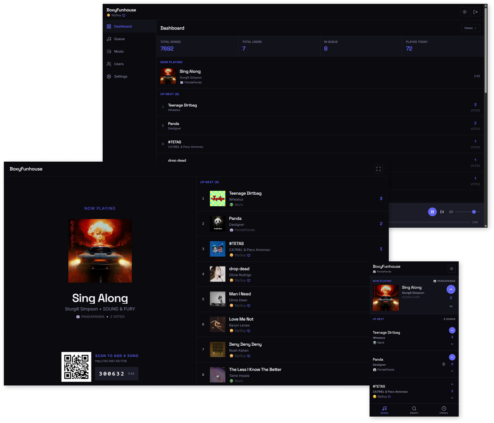
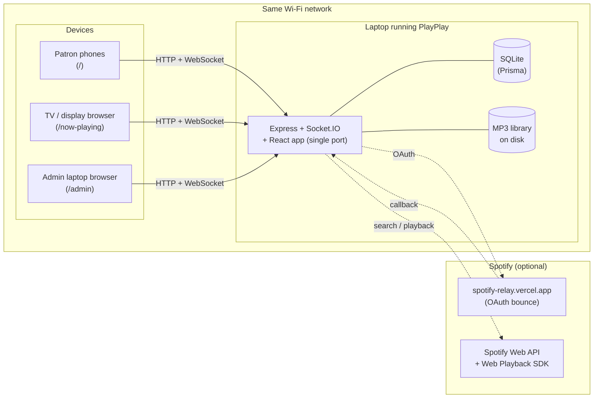

# PlayPlay



A self-hosted, collaborative jukebox for venues, parties, workplaces, road trips... anywhere! Install it on Mac, PC, or Linux to start playing music. Display the Now Playing screen on TVs or monitors, where guests can scan a QR code to join the party and suggest songs, and vote on the queue, all from their phones.

Music can come from a **local folder of MP3s** (fully offline) or from **Spotify** (requires a Spotify Premium account on the playback device).

---

## Features

- Vote on the songs in the queue and add your own suggestions
- Now Playing screen to show what's on rotation and what's queued up. Also shows a QR code for anyone to join the party
- Admin dashboard to manage playback, queue, music, and users
- Use local MP3s or your premium Spotify account
- **Themes!** — you can pick your own theme; venues can set a theme for the Now Playing screen.

## Hardware & network requirements

- **Computer running macOS, Windows, or Linux with Node.js 20+**. It's a single Express server + Vite-built React app.
- **Same Wi-Fi** for all devices.
- **TV or large monitor** for the Now Playing display (optional but recommended). Anything that can open a web page works — a Chromecast/AppleTV browser, a Raspberry Pi, or a spare laptop.
- **Spotify Premium account (optional)** if you choose Spotify mode (Premium is a Spotify-side requirement for Web Playback SDK streaming).

---

## How it works

Install PlayPlay on the computer that will play the music — either from a folder of MP3s on its drive or through a signed-in Spotify session. Using the browser, three kinds of screens connect to it over the same Wi-Fi network:

- **The admin page** (`/admin`) is for you. Sign in to manage the queue, reorder or remove songs, block troublemakers, scan your music library, and change settings.
  - 
- **The Now Playing display** (`/now-playing`) is for the room. Open it full-screen on a TV or spare monitor and it shows the current track, what's coming up, and a QR code patrons can scan to join.
  - 
- **Patron phones** (`/`) are for everyone else. They scan the QR code, pick a name and emoji, then search the catalog to suggest songs and upvote or downvote what others have added. The queue is collaborative — whatever floats to the top plays next.
  - 

Everything syncs in real time, so a vote on someone's phone instantly reshuffles the queue on the TV and in the admin view. When the queue runs dry, a default playlist (recent history, a local folder, or a Spotify playlist) keeps the music going.

---

## Quick start

You need [Node.js 20+](https://nodejs.org/) installed. That's it — the setup script handles `pnpm`, dependencies, the database, and the build for you.

```bash
git clone https://github.com/alanrodriguezdotme/playplay.git playplay
cd playplay
node scripts/setup.mjs
```

The script installs dependencies, then drops you into an interactive wizard. It will ask you, in this order:

1. **Venue name** — e.g. `The Back Patio` (used on the Now Playing screen).
2. **Venue slug** — auto-generated from the name; lowercase letters/digits/dashes.
3. **Admin email** and **password** (8+ characters, asked twice).
4. **Music source** — `Local folder` (drop in MP3s, fully offline), `Spotify` (Premium required on the playback device — see [Spotify setup](#spotify-setup)), or `Skip for now`.
5. **Music library path** — only if you picked local; defaults to `./music` and is created if missing.
6. **HTTP port** — defaults to `3001`.
7. **Spotify Client ID + Secret** — only if you picked Spotify and chose to paste credentials now.

After the prompts, the wizard runs database migrations, builds the app, applies your config, and prints a banner like:

```
◆  Setup complete.

Reachable at:
  http://127.0.0.1:3001
  http://192.168.1.42:3001

  Admin:    /admin
  Patron:   /        (share this URL or scan the QR below)
  Display:  /now-playing

Patron URL: http://192.168.1.42:3001/
[QR code]

◆  Start the server now? ▸ Yes / No
```

Say yes and you're live. Open `/admin` on the laptop, point the TV at `/now-playing`, and share the LAN URL (or have people scan the QR code) with patrons on the same Wi-Fi.

| Path           | Who it's for                                    |
| -------------- | ----------------------------------------------- |
| `/`            | Patrons (mobile-first queue + search)           |
| `/admin`       | You — sign in with the email + password you set |
| `/now-playing` | Big-screen display (open on the venue TV)       |

Almost every setting can be changed later in `/admin` settings or by re-running the wizard with `pnpm setup --reconfigure`. Once setup is complete, `pnpm start` (or the double-click launchers below) starts the server without re-prompting.

## Regular use

After the first wizard run you have two equivalent ways to start the venue:

- **Terminal:** `pnpm start`
- **Double-click launchers** in [`scripts/launchers/`](scripts/launchers/):
  - macOS — `setup.command`, `start.command` (right-click → Open the very first time to bypass Gatekeeper)
  - Windows — `setup.bat`, `start.bat`
  - Linux — `setup.sh`, `start.sh`

`start.*` opens the admin page in your default browser shortly after the server is up. `setup.*` re-runs the wizard.

To share the patron link, scan the QR shown in the terminal at startup, or copy any of the printed LAN URLs.

---

## Spotify setup

Spotify is optional. You can add or change credentials anytime under **Admin → Settings → Music Source → Spotify**.

### Prerequisites

- A **Spotify Premium account** on whichever device is doing the actual playback. Premium is a Spotify requirement for the Web Playback SDK; PlayPlay doesn't add any Premium gating of its own.
- A **Spotify dev account** to create the developer app — the dashboard is free.
- About 5 minutes to register the app and add allowed users.

### Step 1 — Create the Spotify Developer app

1. Open <https://developer.spotify.com/dashboard> and log in.
2. Click **Create app**.
3. Fill in:
   - **App name** — anything (e.g. "PlayPlay – <your venue>").
   - **App description** — anything.
   - **Website** — can be blank.
   - **Redirect URI** — paste this exactly and click **Add**:
     ```
     https://spotify-relay.vercel.app
     ```
   - **APIs** — check **Web API** and **Web Playback SDK**.
4. Agree to the terms and click **Save**.
5. Open the app and grab the **Client ID** and **Client Secret** (click "View client secret"). You'll paste these into PlayPlay shortly.

### Step 2 — Add allowed Spotify users (important!)

By default, every new Spotify app starts in **Development Mode**. In Dev Mode, only Spotify accounts you explicitly add can sign in to your app — anyone else gets a vague 403 / "Connection failed" error.

For each Spotify account that needs to authenticate (typically one per computer):

1. In the dashboard, open your app → **User Management** (sidebar).
2. Click **Add new user**.
3. Enter the user's **Spotify display name** and the **email address** on their Spotify account, exactly as they appear in their Spotify profile.
4. Save.

### Step 3 — Paste the credentials into PlayPlay

You can do this either way:

- **In the wizard** — when you pick `Spotify` as the music source, the wizard prompts for the Client ID and Secret right there (the secret input is masked).
- **In the Admin UI** — sign in to `/admin`, go to **Settings → Music Source**, switch to **Spotify**, and use the **Spotify App Credentials** section. The relay URL is shown for one-click copy.

Credentials are encrypted at rest in the SQLite database (AES-256-GCM with a key derived from `JWT_SECRET`). The Admin UI never echoes the secret back after saving.

### Step 4 — Connect a Spotify account

Once credentials are saved, click **Connect Spotify** under **Admin → Settings**. You'll be sent to Spotify to grant access, then bounced back to the admin page. If everything is wired up, the page shows your Spotify display name and a green "Connected" indicator.

### Why a relay?

Spotify only accepts HTTPS redirect URIs (with the lone exception of the `127.0.0.1` loopback). Your venue's install runs on a LAN IP like `http://192.168.1.42:3001`, which Spotify rejects. The relay at <https://spotify-relay.vercel.app> is a single static HTML page that receives the OAuth callback over HTTPS and immediately forwards the code back to your local server.

It never sees your client secret — it only handles the public OAuth `code` parameter and the venue ID — so the security boundary is exactly what Spotify already trusts.

### Self-hosting the relay

The shared relay is a single static page; one person's account underpins it for everyone. If you'd rather not depend on it (or want a backup), you can host your own:

1. The page is the standalone HTML file at [`packages/spotify-relay/index.html`](packages/spotify-relay/index.html).
2. Deploy it to **Vercel**, **Netlify**, **Cloudflare Pages**, or any static host (the file has no build step).
3. Add the deployed HTTPS URL to your Spotify app's Redirect URIs.
4. In **Admin → Settings → Spotify Credentials**, set the **Relay URL** to your deployed URL.

---

## Architecture

PlayPlay is a single Node.js process serving an Express HTTP API, a Socket.IO realtime layer, and the built React app — all on one port. Persistence is local SQLite via Prisma. Audio either streams from local MP3s on disk (with HTTP range requests for seeking) or from Spotify via the Web Playback SDK.



The four big pieces:

- **Server** ([`packages/server`](packages/server/)) — Express routes (`/api/*`), Socket.IO rooms keyed by venue, Prisma + SQLite, music scanner, Spotify OAuth + playback.
- **Web app** ([`packages/web`](packages/web/)) — React + Vite + TailwindCSS. Three view families behind one bundle: patron, display, admin.
- **Shared types** ([`packages/shared`](packages/shared/)) — TypeScript types/constants used by both sides.
- **Spotify relay** ([`packages/spotify-relay`](packages/spotify-relay/)) — single static HTML file deployed to Vercel; bounces Spotify OAuth back to the LAN.

In production all of this runs from `node packages/server/dist/index.js` and the React build is served from the same port. In development, `pnpm dev` runs Vite on `:1738` proxying `/api` and `/socket.io` to the server on `:3001`.

---

## Updating

```bash
git pull
pnpm setup
```

`pnpm setup` (without `--reconfigure`) is idempotent: it skips the wizard prompts, runs any new Prisma migrations, rebuilds, and offers to start the server. Pass `--reconfigure` to re-prompt for venue/admin/Spotify settings without touching songs or queue history.

---

## Troubleshooting

- **Port already in use** — re-run `pnpm setup --reconfigure` and pick a different port, or edit `PORT=` in [`packages/server/.env`](packages/server/.env) and restart.
- **Patrons can't reach the URL** — confirm everyone is on the same Wi-Fi (no AP/guest isolation). On Windows, allow `node.exe` through Windows Defender Firewall (the prompt appears the first time the server starts) and make sure the Wi-Fi profile is set to **Private** (not Public).
- **macOS Gatekeeper blocks `.command`** — right-click the file in Finder → **Open** the very first time. Subsequent double-clicks work normally.
- **Forgot the admin password** — `pnpm setup --reconfigure` and pick a new password. Songs, queue history, and Spotify connection are preserved.
- **Spotify "Connection failed" / 403 from `getMe`** — the Spotify account isn't on the app's allowlist. Add it under **Spotify Dashboard → your app → User Management** (see [Step 2 above](#step-2--add-allowed-spotify-users-important)).
- **Spotify "Premium is required for playback"** — the connected account isn't Premium. Connect a Premium account (or upgrade), then click **Connect Spotify** again.
- **Spotify "Invalid redirect URI"** — the Redirect URI on your Spotify app must be exactly `https://spotify-relay.vercel.app` (no trailing slash, no extra path). Or use your self-hosted relay URL if you set one.
- **Wizard doesn't re-prompt** — that's intentional once you're configured. Pass `--reconfigure` (`pnpm setup --reconfigure`) to change venue/admin/Spotify settings. The wizard knows you're configured when `packages/server/.playplay-configured` exists locally; this file is per-install and never committed.

---

## Development

```bash
pnpm dev   # server on :3001, Vite dev server on :1738 with HMR
```

See [CONTRIBUTING.md](CONTRIBUTING.md) for monorepo layout, build/test commands, and conventions.

## License

[MIT](LICENSE) © PlayPlay contributors.

[](LICENSE) [](https://nodejs.org/) [](#architecture)
